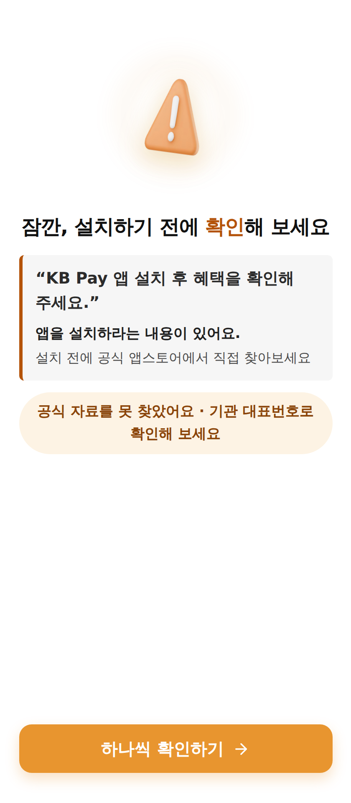
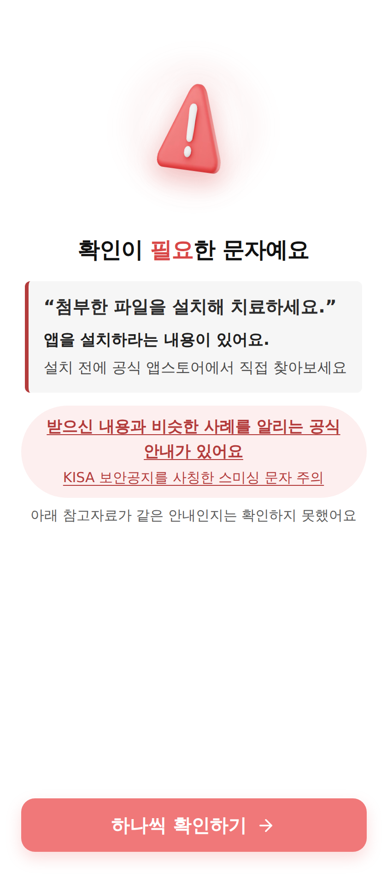
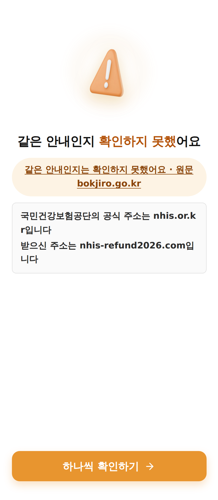

<div align="center">

# 👁️ 곁눈 <sub>Gyeotnun</sub>

**판정하지 않습니다. 함께 확인합니다.**

### 🏅 제8회 K-디지털 트레이닝 해커톤 **장려상**

<sub>Second Look · 6인 팀 프로젝트 · 2026</sub>

시니어가 받은 문자·이미지를 스스로 확인하도록 돕는 정보판단 AI 코치

[](https://zln02.github.io/gyeotnun/)
[](https://zln02.github.io/gyeotnun/watch.html)
[박진영 케이스 스터디](docs/portfolio/박진영_케이스스터디.md)


| 행동 안내 | 경보문 매칭 | 주소 대조 |
|:---:|:---:|:---:|
|  |  |  |
| 앱 설치를 요구하는 문자 | 기관이 낸 경보문을 근거로 | 공식 주소와 나란히 |

<sub>세 장 모두 <b>합성 문장</b>으로 찍었습니다. 실제로 받은 문자를 쓰면 마스킹된 화면이라도
발신번호·링크·금액이 함께 남기 때문입니다. 화면 속 <code>nhis-refund2026.com</code> 은
실재하지 않는 주소이고, <code>nhis.or.kr</code>·<code>bokjiro.go.kr</code> 은 실제 공식 주소입니다.</sub>

</div>

---

## 30초 요약

|  |  |
|---|---|
| **무엇** | 의심스러운 문자를 공유하면 공식 근거를 찾아 **확인 질문**을 드립니다 |
| **왜 판정 안 하나** | 진위를 확정하지 않고 위험 신호·공식 근거·확인 질문을 보여 줍니다. 최종 판단은 사용자에게 남깁니다 |
| **맡은 일** | 백엔드·AI (6인 팀) — 근거 검색 · 질문 생성 API · 배포 · 정량 평가 체계 |
| **기간** | 2026년 7~8월 개발 · 포트폴리오 기록 |
| **결과** | 제8회 K-디지털 트레이닝 해커톤 **장려상** |
| **체험** | [GitHub Pages 포트폴리오 데모](https://zln02.github.io/gyeotnun/) — 합성 사례의 고정 응답, 실제 분석 아님 |

<br>

## 포트폴리오 안내

이 저장소는 **Second Look 6인 팀의 공동 프로젝트**입니다. 아래의 구현·측정 결과를 개인 단독 성과로 해석하지 않도록, 역할과 검증 범위를 구분했습니다.

| 빠르게 볼 내용 | 위치 |
|---|---|
| 동작 화면 | [행동 안내](docs/img/screen-action.png) · [경보문 근거](docs/img/screen-alert.png) · [주소 대조](docs/img/screen-domain.png) · [데모 화면](docs/demo/) |
| 시연 영상 | **[브라우저에서 바로 재생](https://zln02.github.io/gyeotnun/watch.html)** — 43초 한국어 내레이션. 과거 앱 화면 캡처 재구성이며 라이브 조작 녹화 아님 ([제작 방식](#시연-영상에-대하여)) |
| 영상 원고·재제작 | [내레이션 원고 · 장면표 · 교체 템플릿](docs/portfolio/영상제작_템플릿.md) |
| 개인 케이스 스터디 | [박진영: 백엔드·배포, 기술적 선택과 검증 경계](docs/portfolio/박진영_케이스스터디.md) |
| 박진영 담당 | 백엔드 API·DB·배포·정량 평가 체계. 팀 전체 역할은 [팀](#팀) 참조 |
| 기술 의사결정과 재현 가능한 수치 | [측정 결과](#측정-결과) · [실험/결정 문서 색인](docs/README.md) |
| 기획 대비 실제 구현과 미검증 항목 | [구현 범위와 검증 경계](#구현-범위와-검증-경계) |

> **아카이브 읽는 법:** 수치는 표기된 평가셋·날짜에 한정됩니다. 아래 스크린샷은 합성 입력의 실제 화면이고, 60대 사용자를 대상으로 한 효과 검증 결과는 아닙니다. GitHub Pages는 VM을 대체한 **화면 체험용 정적 데모**로, OCR·검색·LLM 호출이나 실제 문자 판별을 하지 않습니다.

### 시연 영상에 대하여

▶ **재생: <https://zln02.github.io/gyeotnun/watch.html>** · 42.9초 · 1920×1080 · 한국어 내레이션 + 자막

`입력 → 위험 신호와 확인 질문 → 공식 근거 → 사용자 판단 → 5분 연습` 순서로 서비스 흐름을 보여줍니다.

> **저장소 링크로는 재생되지 않습니다.** GitHub 파일 뷰어는 이 크기(4.2MB)의 영상을 표시하지 못하고,
> `raw.githubusercontent.com` 은 재생이 아니라 내려받기로 응답합니다. 그래서 GitHub Pages 에 함께 올려
> 재생 페이지를 따로 뒀습니다. 파일 자체는 [`docs/portfolio/`](docs/portfolio/) 에 있고
> ([mp4](docs/portfolio/gyeotnun-screen-walkthrough.mp4) · [srt](docs/portfolio/gyeotnun-screen-walkthrough.srt)),
> 클릭하면 내려받기가 됩니다.

| | 내용 |
|---|---|
| **만든 방식** | 저장소의 과거 앱 화면 캡처([`docs/demo/`](docs/demo/))를 확대·패닝·전환으로 재구성했습니다. **UI와 글자를 AI로 생성하거나 다시 그리지 않았습니다.** 화면 픽셀은 캡처 원본 그대로입니다 |
| **음성** | espeak-ng **TTS 합성**입니다. 사람이 녹음한 음성이 아닙니다 |
| **입력 사례** | 합성 사례입니다. 실제 이용자의 문자나 개인정보가 아닙니다 |
| **배경음악** | 없음 (저작권이 확실한 음원이 없어 넣지 않았습니다) |
| **재생성** | [영상 제작 템플릿](docs/portfolio/영상제작_템플릿.md)에 원고·장면표·명령어가 있습니다 |

**정적 데모와의 차이**

| | 시연 영상 | [GitHub Pages 정적 데모](https://zln02.github.io/gyeotnun/) |
|---|---|---|
| 주소 | [/watch.html](https://zln02.github.io/gyeotnun/watch.html) | [/](https://zln02.github.io/gyeotnun/) |
| 성격 | 과거 화면 캡처를 이어 붙인 **영상** | 브라우저에서 눌러 보는 **화면 체험** |
| 상호작용 | 없음 (재생만) | 있음 (고정 응답) |
| 서버 호출 | 없음 | 없음 — OCR·검색·LLM 호출 안 함 |
| 보여주는 것 | 5단계 흐름 전체를 순서대로 | 합성 사례에 대한 고정 응답 |

둘 다 **현재 운영 중인 서버를 호출하지 않습니다.** 서버 VM은 종료했습니다.

**아직 없는 자료** — 없는 파일이나 링크를 만들어 두지 않았습니다.

- **상장 원본**: 미보유. 받는 대로 `docs/portfolio/award/` 에 추가하고 영상 장면을 덧붙입니다 ([절차](docs/portfolio/영상제작_템플릿.md#4-1-상장-원본-현재-없음))
- **실제 조작 화면 녹화본**: 저장소·원격 브랜치·릴리스에서 찾지 못했습니다. 확보하면 이 재구성본을 덮어쓰지 않고 `gyeotnun-live-recording.mp4` 로 **따로** 추가합니다 ([절차](docs/portfolio/영상제작_템플릿.md#4-2-실제-화면-녹화-현재-없음))

---

## 빠르게 돌려보기

**API 키도, GPU도, 무거운 라이브러리도 필요 없습니다.** 패키지 10개만 설치하면 화면 흐름 전체가 동작합니다.

```bash
cp .env.example .env                              # 키는 비워 둬도 됩니다
cd api && pip install -r requirements-mock.txt    # 설치 163MB (torch 없음)
uvicorn main:app --port 8000

cd ../web && npm install && npm run dev           # http://localhost:5173
```

모든 엔드포인트에 `?mock=1` 을 붙이면 고정 응답을 돌려줍니다.

```bash
curl "http://localhost:8000/api/v1/checks/chk_demo/evidence?mock=1"
```

<details>
<summary>실제 모델까지 돌리려면 (torch 만 약 1.1GB)</summary>

<br>

```bash
pip install -r requirements.txt    # torch · paddle 포함
```

`torch`·`paddle` 은 실제로 쓰이는 순간에만 불러옵니다(지연 import). mock 모드에서는 아예 로드되지 않으므로, 화면 흐름만 보실 때는 위의 가벼운 설치로 충분합니다.

</details>

<details>
<summary>⚠️ 실제 모드(<code>mock=0</code>)로 돌리면 근거 검색이 0건으로 나옵니다</summary>

<br>

검색 대상 문서와 색인을 저장소에 포함하지 않았기 때문입니다. 수집한 공공기관 자료 가운데 상당수가 **개별 이용 조건 확인이 필요한 상태**여서, 확인이 끝나기 전까지 공개 저장소에 재배포하지 않기로 했습니다.

```
코퍼스 1,059건 중 이용 조건 "확인 필요"    682건 (64.4%)
이용허락범위가 명확한 것                    377건
```

이때 화면에 오류가 뜨지 않고 근거만 0건으로 나오므로, 처음 보시면 "검색이 안 되는 서비스"로 보일 수 있습니다. 로컬 백엔드가 있으면 **`?mock=1`** 로 고정 응답 흐름을 재현할 수 있고, 백엔드 없이 화면만 보려면 [GitHub Pages 정적 데모](https://zln02.github.io/gyeotnun/)를 사용하세요.

첫 실행 시 임베딩 모델(약 120MB)을 자동으로 내려받습니다. 오프라인 환경에서는 이 단계에서 멈춥니다.

</details>

---

> ### 📌 코드보다 [`docs/evaluation/`](docs/evaluation/) 을 먼저 봐 주십시오
>
> 이 프로젝트에서 가장 오래 걸린 일은 기능을 만드는 것이 아니라 **만든 것이 정말 나아졌는지 확인하는 일**이었습니다.
>
> ```
> 기각 기록   7건    측정 후 채택하지 않기로 한 실험
> 정정 이력   7건    앞선 결론을 뒤집고 그 경위를 남긴 것
> 사고 기록   1건    실제 피해가 발생한 것 (운영 데이터 삭제)
>                   ── 2026-08-22 기준. 기록이 늘면 이 수도 늘어납니다
> ```

---

## 다섯 가지 이야기

<br>

### 1️⃣ 우리 성과를 우리가 깎았습니다

```diff
  예선 제출 시점   95.5%   ← 22건 기준(30건 중 음성 8 제외) · 1건이 4.5%p
- 평가셋 120건 확대 후   71.4%
- 홀드아웃 30건(처음 보는 세트)   70.0%
```

**서로 겹치지 않게 만든 두 세트가 1.4%p 안에서 만났습니다.** 한 번은 우연일 수 있지만 두 세트가 같은 값을 가리키기는 어렵습니다.

<details>
<summary>왜 평가셋을 늘렸나 · 어떻게 만들었나</summary>

<br>

30건 세트로는 1건이 3.3%p, 실제 채점 모수인 22건으로는 **1건이 4.5%p** 라 개선을 측정할 수 없었습니다. 리랭커를 넣어 25/30 → 26/30이 됐을 때 그게 개선인지 우연인지 구분할 방법이 없었습니다.

```
평가셋      30건  →  120건   (정상 40 · 사칭 40 · 경계 40)
홀드아웃    0건   →  30건    검색 코퍼스에 절대 넣지 않음
```

특히 **팀원이 실제로 받은 문자 11건**을 넣은 것이 결정적이었습니다. 합성한 정상 문자는 하나도 빠짐없이 "얌전"했는데, 실제로 받은 정상 문자에는 앱 설치나 인증번호를 요구하는 것이 섞여 있었습니다.

```
합성 정상 26건     위험행동 0건    (0%)
실사용 정상 11건   위험행동 2건    (앱설치 1 · 인증번호 1)
```

두 건뿐이지만 **합성 세트에서는 26건 중 0건**이었습니다. 정상 문자에도 위험행동이 섞인다는 것을 합성 데이터만으로는 알 수 없었습니다.

이 발견이 없었다면 이후의 모든 개선을 잘못된 기준 위에서 측정했을 것입니다.

📄 `docs/evaluation/` — 확대 평가셋 구축 · 홀드아웃 설계 · 기준선 측정

</details>

<br>

### 2️⃣ 가장 좋은 질문이 우리 가드레일에 걸려 죽고 있었습니다

사칭 문자에 대해 모델이 만든 질문:

```
"받으신 주소 nhis-refund24.com과 공식 주소 nhis.or.kr을 비교해 보셨나요?"
```

사칭 대응으로는 가장 좋은 질문입니다. 그런데 화면에는 **전혀 다른 문장**이 나갔습니다.

```
문장 수를 세는 정규식이 도메인 안의 점을 문장 끝으로 셈

  [1] 받으신 주소 nhis-refund24
  [2] com과 공식 주소 nhis
  [3] or
  [4] kr을 비교해 보셨나요        → "4문장" → 길이 초과 → 폴백
```

폴백 문장은 *"기관 이름이 보이지 않는다면 확인해 볼 신호입니다"* 였는데, **그 문자에는 기관명이 명시돼 있었습니다.** 사칭 문자 앞에서 안심시키는 방향으로 작동하고 있었습니다.

<details>
<summary>저장된 데이터에는 이 문제가 보이지 않았습니다 — 생존자 편향</summary>

<br>

```
평가 기록 112건 중 두-도메인 비교 질문   0건
```

만들어졌다가 **전부 죽어서 기록에 남지 않은** 것입니다. 데이터만 봤다면 *"모델이 그런 질문을 안 만든다"* 고 결론냈을 것이고, 라이브에서 직접 써 보고서야 발견했습니다.

더 나쁜 것은 원인이 **8/16에 제가 추가한 기능**이었다는 점입니다.

```
도메인 대조 기능 추가
  → 근거에 도메인 2개
  → 모델이 두 주소를 비교하는 질문 생성 (의도한 대로)
  → 점 3개 → 4문장 판정 → 폐기
```

수정 후 폴백률 **2.7% → 0.9%**, 길이 초과로 인한 폴백 0건.

그리고 8/05에 실험 파일에서 같은 문제를 발견하고 **그 파일에서만 우회**한 주석이 있었습니다. 12일 뒤 라이브 사고가 됐습니다. 이후 "우회는 발견을 소비해 버린다"를 규칙으로 만들었습니다.

📄 `docs/evaluation/` — 문장 분리 진단 · 자기시험(막아야 할 것이 여전히 막히는지)

</details>

<br>

### 3️⃣ 데이터를 늘리면 안전장치가 자동으로 느슨해집니다

사기 사례 매칭 점수에 IDF 가중이 들어 있었습니다.

```python
_keyword_weight = log((N_DOCS + 1) / (df + 1)) + 1.0
```

```
사례 51건 → 185건    모든 단어 가중치 +32%   (log(N+1) 비 1.323)
하한선 5.0           그대로
```

**아무도 코드를 고치지 않았는데 방어가 약해집니다.** 그리고 우리가 하려던 일이 정확히 "코퍼스 수집"이었습니다.

<details>
<summary>재교정 곡선은 로그가 아니라 계단이었습니다</summary>

<br>

| SCAM_CASES | 정상 오판 0 유지에 필요한 최소 min_score |
|---:|---:|
| 51 (현재) | 6.75 |
| 80 | 13.75 |
| 120 | 14.00 |
| 185 | 14.75 |

51 → 80에서 **2.04배** 뜁니다. 최소 임계가 "가장 높은 점수를 받은 정상 케이스 하나"로 결정되는 극단값이라 매끄러운 함수가 될 수 없습니다.

정확히는 **"당장 오판이 늘지는 않고 안전 여유가 깎인다"** 입니다. 그리고 N=51인 현재도 5.0은 이미 부족합니다 — 정상 오판이 1건 납니다.

이후 하한선 결정 문서에 *"이것은 N=51에서의 5.0이지 영구 결정이 아니다"* 를 명시하고, 코퍼스 규모가 바뀌면 매일 도는 회귀 검사가 실패하도록 걸었습니다.

📄 `docs/evaluation/` — IDF 척도 이동 · 재교정 곡선 · 구조적 해법 4안 비교

</details>

<br>

### 4️⃣ 운영 데이터 262행을 지웠습니다

```sql
-- 세는 쿼리
where device_hash = X and created_at >= '15:40'   →  17행

-- 지우는 쿼리
where device_hash = X                             →  262행
```

백업이 없어 복구하지 못했습니다. 더 나쁜 것은 **삭제 직전에 `262`를 화면에 출력해 놓고 같은 명령에서 DELETE가 나갔다**는 점입니다.

> **확인을 '출력'하는 것과 '차단'하는 것은 다릅니다.**

<details>
<summary>이 건은 재발 방지를 도구로 만들었습니다</summary>

<br>

`api/tools/delete_rows.py`

```
1. --expect 값과 실제 행 수가 다르면  →  아무것도 지우지 않고 중단
2. 백업을 임시 테이블에 실제로 복원   →  체크섬 대조
3. 대조가 통과해야만                 →  삭제 진행
```

그 리허설은 **다음 날 자기 결함을 잡았습니다.** CSV가 JSON 컬럼을 파이썬 `repr`(작은따옴표)로 저장해 복원이 불가능한 상태였는데, 리허설이 없었다면 "백업이 있다"고 믿은 채 지웠을 것입니다.

📄 `docs/reports/2026-08-17_사고기록_events_262행_삭제.txt`

</details>

<br>

### 5️⃣ 허용 목록과 차단 목록 — 빠뜨렸을 때 어느 쪽으로 실패하는가

화면 경고 단계를 올리는 판정을 **차단 목록에서 허용 목록으로** 뒤집었습니다.

```
차단 목록   목록에 없는 신호는 통과       →  잊으면 화면이 조용히 더 무서워짐
허용 목록   목록에 있는 신호만 승격       →  잊으면 아무 일도 안 일어남
```

당시 근거는 원칙뿐이었는데, 8일 뒤 측정에서 숫자가 나왔습니다.

```
신호 기준으로 세면    11/37  (29.7%)
화면 기준으로 세면     2/37
                     ────────
차이 9건              허용 목록이 막은 것
```

**서버가 모르는 키는 승격될 수 없습니다.**

---

## 작업 원칙

대부분 한 번씩 어겨 보고 나서 규칙이 됐습니다.

| 원칙 | 계기 |
|---|---|
| 외부 공개 수치를 쓰지 않고 자체 서버에서 잰다 | 사전에 정한 규칙. 임베딩 후보도 공개 벤치마크가 아니라 우리 서버에서 쟀습니다 (상용 112ms · 로컬 558ms) |
| 평가 데이터의 실패 사례를 보고 그 사례를 통과시키지 않는다 | 코퍼스 209건 기각 사고 |
| 스킵은 실패로 센다 | 아무것도 검사하지 않은 초록불이 가장 위험 |
| 실패해야 할 검사가 실제로 실패하는지 확인한다 | 도달 불가 URL로 복구 경로를 직접 시험 |
| 백업은 복원이 증명되기 전까지 백업이 아니다 | 위 사례 4 |
| 실험에서 본체 결함을 우회했다면 대장에 올린다 | 우회 주석이 12일 뒤 라이브 사고가 됨 |
| 지표 이름이 실체를 말하게 한다 | "오판없음"이 신호 기준인데 화면 기준으로 오인용 |
| 채택은 사람이 결정한다 | — |

---

## 기술 구성

```
                     ┌─────────────── 자체 서버 ───────────────┐
  문자·이미지  →  OCR  →  마스킹  →  근거 검색  →  링크 확인  →  ┐
                  Paddle    정규식     e5-small       SSRF 방어    │
                                       + BM25 폴백                 │
                                                                   ↓
                                        개인정보가 제거된 문장 →  Claude API
                                                                   ↓
                                                              확인 질문
```

| 단계 | 구현 | 비고 |
|---|---|---|
| 입력 | Android Sharesheet (PWA) | 이미지 · 링크 · 텍스트 |
| 이미지 인식 | PaddleOCR `korean_PP-OCRv5_mobile` | **자체 서버** · 외부 API에서 전환 |
| 마스킹 | 정규식 4종 (주민·카드·개인 연락처·계좌) | 기관 대표번호는 의도적으로 남김 |
| 근거 검색 | `dragonkue/multilingual-e5-small-ko-v2` (384d) | **자체 서버** · Apache-2.0 · BM25 폴백 |
| 링크 확인 | 리다이렉트 최종 주소 · 기관 도메인 대조 | SSRF 방어 · DNS 리바인딩 홉마다 재검증 |
| 질문 생성 | Claude API · 판정 억제 2단 | **유일한 외부 호출 구간** |
| 운영 | FastAPI · React · Docker · nginx | AWS EC2 |

<details>
<summary>왜 로컬로 전환했나</summary>

<br>

비용 때문만이 아닙니다. **원본 이미지가 서버 밖으로 나가지 않는다**는 것이 시니어 대상 서비스에서 설명 가능한 상태를 만듭니다.

```
확인 1건 외부 API 비용
  텍스트만        23.82원
  이미지 포함     28.28원      (도입가 기준 ~2026-08-31 · 이후 정상가 42.42원)
```

외부로 나가는 것은 질문 생성 단계의 **개인정보가 제거된 문장**뿐입니다.

</details>

---

## 측정 결과

<sub>확대 평가셋 112건 · 홀드아웃 30건 · 2026-08-21 기준</sub>

| 지표 | 확대 112건 | 홀드아웃 30건 |
|---|---:|---:|
| **확신 상태의 오답 근거** | **0건** | **0건** |
| 사칭 문자 경고 | 37/37 (100%) | 10/10 (100%) |
| 위험행동 있는 문자에 경고 | 39/39 (100%) | 11/11 (100%) |
| 정상 문자를 **사기 의심**으로 표시 | 1/37 (2.7%) | 1/10 (10.0%) |
| 정상 문자에 **경고 계열 화면**(행동 안내 포함) | 2/37 (5.4%) | 1/10 (10.0%) |

> **가장 중요한 것은 첫 줄입니다.** 근거를 못 찾는 건 되돌릴 수 있지만, 틀린 근거를 확신과 함께 내미는 건 되돌릴 수 없습니다.

```
코퍼스        공식 문서 1,059건 · 검색 청크 2,036개 · 사기 사례 51건
동시 3명      텍스트 여정 14.77초 → 5.46초 · 사진 24.14초 → 10.70초 · 실패 0   (2026-08-16 기준)
```

---

## 구현 범위와 검증 경계

초기 기획은 **사진·링크·음성 입력 → 근거 확인 질문 → 오판 유형 태깅 → 개인화된 5분 훈련 → 성장 리포트**였습니다. 아래는 **2026년 8월 기능 개발 종료 시점**의 상태입니다. 이후 커밋은 포트폴리오 정리와 서버 없는 화면 데모 배포를 위한 것으로, 아래 기능의 검증 범위를 넓히지 않습니다. 전 과정을 동일한 수준으로 완성하거나 효과까지 입증한 것은 아닙니다.

| 항목 | 저장소에서 확인되는 범위 |
|---|---|
| 입력·근거·질문 | 문자·이미지 중심의 OCR, 공식 자료 검색, 질문 생성 및 안전장치. 음성 입력 경로는 미구현 |
| 훈련 | 화면의 4단계 실습은 **고정 예시**. 서버의 카드 3장은 별도 API이며 화면 실습과 연동되지 않음 |
| 개인화·성장 | 행동 로그용 DB/API와 일반 화면 이벤트 계측은 마련했으나, 판단 행동 로그의 핵심 필드가 프론트와 미연동이라 확인 행동 변화나 훈련 효과를 입증하지 못함 |
| 사용자 검증 | 60대 대면 테스트 미실시. 시니어 접근성 수치와 화면 설계는 **설계·자체 점검**이지 실사용 검증 결과가 아님 |

따라서 이 프로젝트의 검증된 성과는 **검색·질문·가드레일·배포와 평가 체계**에 있으며, **시니어 판단력 향상**은 후속 검증 과제입니다. 세부 근거는 [훈련카드 현황](docs/evaluation/training_card_status.md), [판단행동 로그 설계](docs/판단행동로그_설계_2026-08-20.md), [미해결 대장](docs/evaluation/본체결함_발견대장.md)에 남겼습니다.

---

<details>
<summary><b>⚠️ 알려진 한계</b> — 전부 <code>docs/evaluation/본체결함_발견대장.md</code> 에 미해결로 올라와 있습니다</summary>

<br>

**개인정보 마스킹**

- 이름·주소는 **구현하지 않았습니다.** 정규식으로는 기관명("보건복지부")까지 오탐해 근거 검색을 훼손하기 때문이며, NER로 처리하는 것을 다음 과제로 남겼습니다.
- 재현율은 기준에 따라 다릅니다.

  ```
  구현한 3종 90필드 기준        97.8%
  이름·주소 포함 156필드 전체    56.4%
  ```

  두 숫자를 모두 적는 이유는, 하나만 적으면 어느 쪽이든 사실과 어긋나기 때문입니다.
- 카드번호는 구현돼 있으나 평가셋에 사례가 0건이라 **검증되지 않았습니다.**
- 기관 대표번호는 **의도적으로 마스킹하지 않습니다.** 화면이 "기관 대표번호로 확인해 보세요"라고 권하는데 그 번호를 가리면 확인할 방법이 사라집니다.

**검색·판정**

- BM25 폴백 경로의 임계값이 코퍼스 규모에 따라 이동합니다. 조정안은 있으나 폴백 경로라 미적용입니다.
- 유사 도메인 대조는 매핑표에 있는 기관에만 작동합니다 (사칭 37건 중 2건 = 5.4%). 사칭 탐지가 아니라 **특정 유형 하나를 메우는 기능**입니다.
- 문구가 정상이고 링크만 가짜인 정교한 클론은 잡지 못합니다. 서버가 링크를 열지 않기 때문이며, SSRF와 클로킹 때문에 의도한 선택입니다.

**측정하지 못한 것**

- 생성된 질문이 입력에 없는 내용을 전제하는지에 대한 검사는 도구까지 만들었으나 파이프라인에 연결하지 않았습니다. 평가셋이 요약문이라(112건 중 URL 실재 10건) 제대로 잴 수 없습니다.
- 확인 취약 패턴 자동분류 4종 중 2종 미구현.
- 판단 행동 로그가 프론트와 미연동이라 "확인 후 실제로 어떤 행동을 골랐는가"가 비어 있습니다.
- **60대 대면 사용성 테스트를 실시하지 못했습니다.** 진행 키트·측정 항목까지 준비했으나 참여자 섭외가 되지 않았습니다. 가장 크게 비어 있는 부분입니다.

</details>

---

## 구조

```
api/          FastAPI — 인식 · 마스킹 · 검색 · 질문 생성 · 태깅
  └ tests/    회귀 검사 · 가드 자기시험
web/          React — 시니어 UX (본문 19px · 버튼 60px · 대비 7:1)
corpus/       공식 문서 수집 · 분류
docs/         실험 · 결정 · 사고 기록          ← 여기
deploy/       배포 · 롤백 · 회귀 검사 · 삭제 가드
```

> 테스트 **개수**는 적지 않습니다. 실험 파일을 하나 추가하면 가드 테스트의 스캔
> 파라미터가 같이 늘어나서, 문서에 박아 두면 아무도 모르게 어긋납니다.
> 실제로 한 번 어긋났습니다(`docs/evaluation/본체결함_발견대장.md` L4).
> 지금 수는 `docker compose exec api python3 -m pytest tests/ -q` 로 봅니다.

레거시 경로는 지우지 않고 **머리말에 표시**해 두었습니다 (`레거시 · 사용 안 함 · 대체: ○○`). 왜 그 방식을 그만뒀는지가 기록의 일부이기 때문입니다.

<details>
<summary>새로 클론한 환경에서</summary>

<br>

검색 대상 문서와 색인은 저장소에 포함하지 않았습니다. 수집한 공공기관 자료 가운데 상당수가 **개별 이용 조건 확인이 필요한 상태**여서, 확인이 끝나기 전까지 공개 저장소에 재배포하지 않기로 했습니다.

따라서 새로 클론한 환경의 실제 모드에서는 근거 검색 결과가 0건으로 나옵니다. [GitHub Pages 데모](https://zln02.github.io/gyeotnun/)는 서버 없이 합성 예시의 화면 흐름만 보여 줍니다.

</details>

---

## 팀

<sub>Second Look · 6인 · 앞이 대외 역할, 뒤가 코드 담당</sub>

| 이름 | 역할 |
|---|---|
| 박진 | PM · 데이터 통합 / 인식 · 마스킹 |
| 김태희 | 공식 근거 검증 / 프롬프트 (판정 억제) |
| 장지석 | 사례 분석 / 태깅 · RAG · 코퍼스 |
| **박진영** | **백엔드 · 배포 / API · DB · 인프라** |
| 김유리 | 프론트 · 시니어 UX / 검색 · 공공데이터 대조 |
| 조희진 | UX 검증 · 데모 시나리오 / 프론트 |
